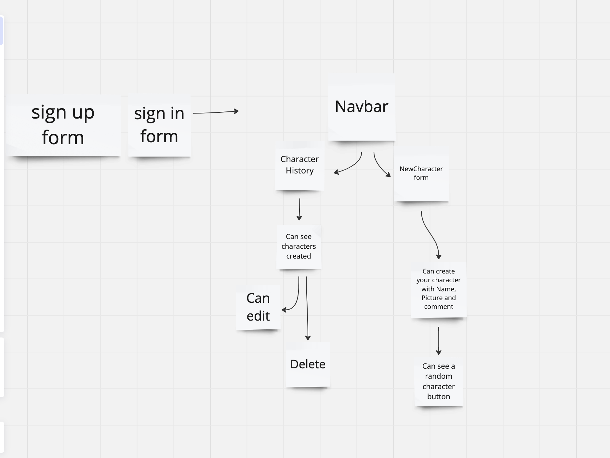
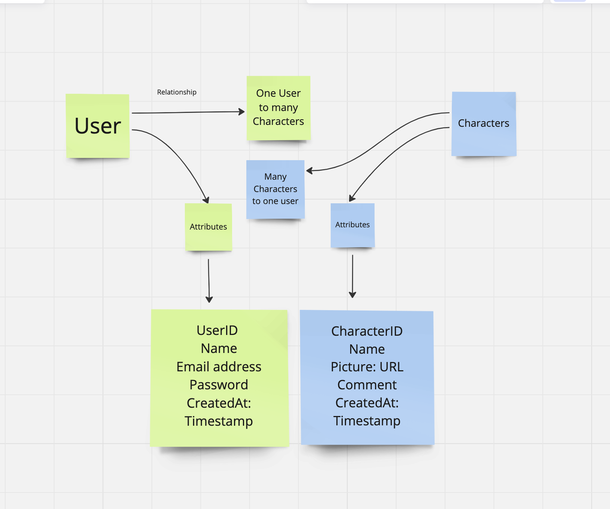

(## [Dragon Ball Z Characters App])

#Introduction:
This is my project for perscholas module 3. It's an  application that allows users to create, edit, delete and view characters from the Dragon Ball Z series. Users can sign up, log in, and manage their characters. 

[Technologies-Used]:
Node.js
Express.js
MongoDB/mongoose
React Vite
JWT for authentication
Bcrypt for passwork hashing
HTML/CSS

(##[Getting-Started]):
You can start the server by running npm start or node server.cjs

(##[Future-Enhancements]):
User profiles: Allowing users to add more information about themselves.
Character images: Allowing users to upload or select character images for their profile.
Search and filter: Implementing search and filter options to find characters easily.
Social features: Adding the ability to share characters or follow other users.

(##[Unsolved Problems]):
Testing: Writing tests for my server and client code to ensure reliability.

(#[WiredFrame]):

(#[Entity-Relationship-Diagram])

(##[Credits]):
Pictures: The images used in this project were sourced from various locations on the web

Mern-infrastructure: 
